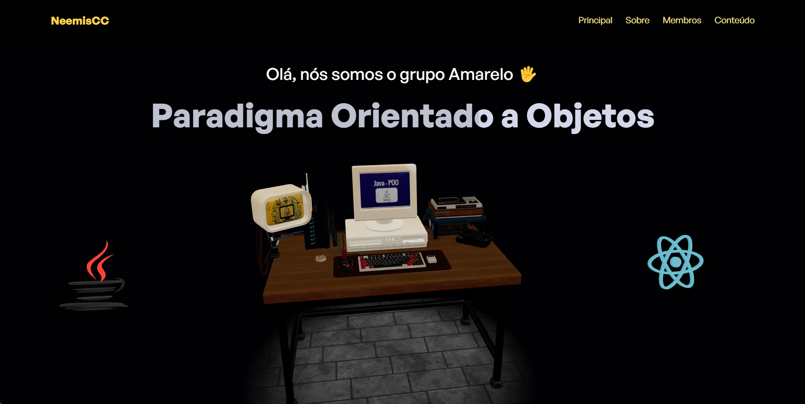
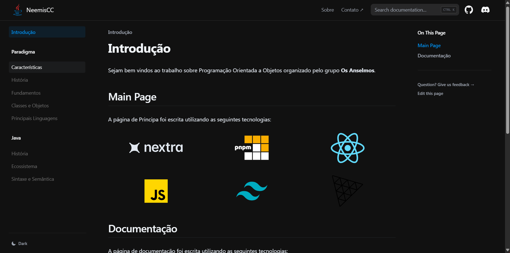
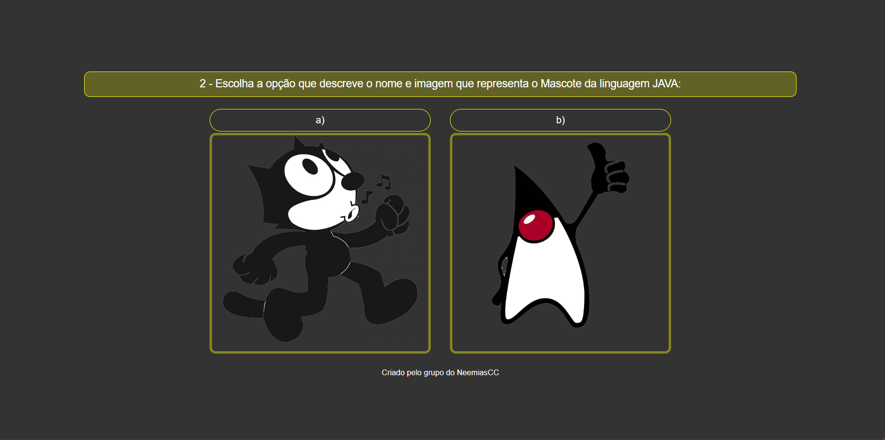

<h4 align="center"> 
	👉 Paradigma de Programação Orientado a objetos (POO) - Java 👈
</h4>

	

## Descrição do Projeto

Este repositório foi criado para a apresentação de um projeto acadêmico sobre o <b>paradigma de programação orientado a objetos</b>, utilizando a linguagem <b>Java</b>. Além do código em Java, o projeto inclui uma pagina de apresentação, uma pãgina sobre o paradigma e a linguagem escolhida, e uma página de quiz.

## Pagínas

### Página de apresentação

A página de apresentação tem como responsabilidade dar uma visão geral sobre o paradigma e apresentar os membros do grupo. A página representa isso através de 'Objetos' 3D.

Link da Página e Repositório respectivamente.
- [https://neemiscc.onrender.com/](https://neemiscc.onrender.com/)
- [https://github.com/Vitor1317/NeemisCC](https://github.com/Vitor1317/NeemisCC)

### Pagina Principal

A página de principal basicamente é responsável pelo contéudo sobre o paradigma e contém as referências.

Link da Página e Repositório respectivamente.
- [https://docs-poo.vercel.app/](https://docs-poo.vercel.app/)
- [https://gitlab.com/davi-oliveira/docs-poo](https://gitlab.com/davi-oliveira/docs-poo)

### Quiz

O quiz é uma forma de revisar o conteúdo da página principal com questões através de imagens para facilitar o aprendizado.

Link da Página e Repositório respectivamente.
- [https://guiviny.github.io/quiz/](https://guiviny.github.io/quiz/)
- [https://github.com/guiviny/quiz](https://github.com/guiviny/quiz)
# :hammer: Funcionalidades do projeto

- 🔍 Explicação de conceitos do paradigma orientado a objetos, como resolução e inferência.
- 📝 Exemplos de código em Java para resolução de problemas e consultas lógicas.
- 📖 Recursos adicionais, como links e referências sobre o ecossistema Java.
- 🌐 Interface web responsiva para a apresentação do projeto, usando NextJs.

## 🚀 Sobre o Projeto
O projeto explora a programação orientada a objetos e a utilização do Java, uma linguagem voltada para as mais variadas finalidades como Front-End(web, mobile, desktop), Back-End, sistemas embarcados entre outros. A interface web é desenvolvida com **NextJs**, garantindo uma apresentação moderna e interativa, com exemplos e explicações detalhadas dos principais conceitos.

## 📂 Projetos em Java

Este repositório contém os seguintes projetos implementados em <b>Prolog</b>

<a href="https://github.com/OrientacaoAObjetosUDFN1/Bomberman-java"> 
<li>Bomberman-Java</li>
</a>
<a href="https://github.com/OrientacaoAObjetosUDFN1/Hangman-Java">
<li>Hangman-Java</li>	
</a>

## 💻 Tecnologias Utilizadas no Projeto
-  React
-  Next
-  JavaScript
-  Typescript
-  Java
-  Spring

Agradecemos aos desenvolvedores por sua dedicação e trabalho árduo na criação deste projeto. Seu esforço é fundamental para tornar essa ferramenta uma realidade! 😃

<table>
  <tr>
     <td align="center"><a href=""> <b>Davi/a> <a href="https://github.com/davi-oliveira" title="">Rgm:xxxxxxxx</a></td>
    <td align="center"><a href=""> <b>Guilherme</b></a> <a href="https://github.com/guiviny" title="">Rgm:xxxxxxxxx</a></td>
    <td align="center"><a href=""> <b>Neemias</b></a> <a href="https://github.com/Albatrovski" title="">Rgm:xxxxxxxxxxx</a></td>
    <td align="center"><a href=""> <b>Pedro</b></a> <a href="https://github.com/pedrontx" title="">Rgm:xxxxxxxx</a></td>
    <td align="center"><a href=""> <b>Ricardo</b></a> <a href="https://github.com/Kroatta" title="Rocketseat">Rgm:xxxxxxxxxx</a></td> 	  
    <td align="center"><a href=""> <b>Vitor</b></a> <a href="https://github.com/Vitor1317" title="">Rgm:30702615</a></td> 	  
</table>

## 💪 Como Contribuir para o Projeto

1. Faça um **fork** do projeto.
2. Crie uma nova branch com as suas alterações: `git checkout -b my-feature`.
3. Salve as alterações e crie uma mensagem de commit contando o que você fez: `git commit -m "feature: My new feature"`.
4. Envie as suas alterações: `git push origin my-feature`.
--

## 🧙‍♂️ Autor

<a href="https://github.com/Vitor1317">

 
<b>Vitor Alves Moraes</b></a> <a href="https://github.com/Vitor1317" title="Cubos Academy">✨</a>

---
